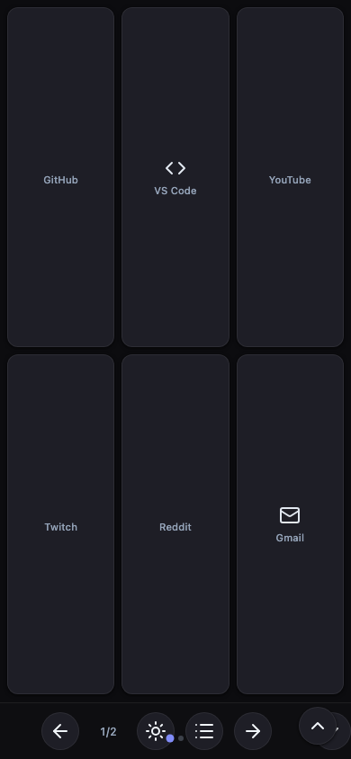

<!-- prettier-ignore -->
<div align="center">
  
  <h1>Panna Cotta</h1>
  <p>A web-based Stream Deck for controlling your Mac from any device on your network.</p>

  [](https://github.com/mwong-io/panna-cotta/actions/workflows/deno_build.yml)
  [](https://deno.land)
  [](LICENSE)

  [Features](#features) • [Quick start](#quick-start) • [Configuration](#configuration) • [Development](#development) • [Building](#building)
</div>

---

Define a grid of buttons in a TOML file. Open the URL on your phone, tablet, or any browser on the same network. Click a button to open a URL or launch a macOS app — instantly, from across the room.



## Features

- **Configurable grid** — set rows and columns to match your device's layout
- **TOML configuration** — define buttons in a simple `stream-deck.config.toml` file
- **Two action types** — open a URL in the client browser or launch a macOS app on the host
- **Any Lucide icon** — use any icon name from [lucide.dev/icons](https://lucide.dev/icons)
- **Pagination** — extra buttons overflow into additional pages automatically
- **PWA installable** — add to your phone or tablet home screen for a native feel
- **Offline-capable** — service worker caches the UI so it loads without a network hop
- **Dark / light theme** — toggle manually; preference is remembered across sessions
- **QR code on home page** — scan to connect a new device in seconds
- **Standalone binary** — ships as a single executable with the frontend embedded; no Deno required on the host

## Quick start

**Prerequisites:** [Deno 2+](https://deno.land), macOS

```sh
git clone https://github.com/mwong-io/panna-cotta.git
cd panna-cotta
deno task start:backend
```

Open [http://localhost:8000](http://localhost:8000) in any browser. The home page shows a QR code — scan it to open the Stream Deck on a phone or tablet.

To access from another device on your network, replace `localhost` with your Mac's local IP address (e.g. `http://192.168.1.x:8000`).

> [!TIP]
> Set the `STREAM_DECK_PORT` environment variable to run on a different port.

## Configuration

Edit `stream-deck.config.toml` in the project root. Changes are picked up on the next page load.

```toml
[grid]
rows = 2
cols = 3

[[buttons]]
name = "GitHub"
type = "browser"
icon = "github"
action = "https://github.com"

[[buttons]]
name = "VS Code"
type = "system"
icon = "code"
action = "Visual Studio Code"
```

### Button types

| Type | Behavior |
| --- | --- |
| `browser` | Opens the `action` URL in the client's browser |
| `system` | Launches the named macOS application on the host Mac |

### Icons

The `icon` field accepts any [Lucide](https://lucide.dev/icons) icon name (e.g. `github`, `youtube`, `mail`, `code`, `music`).

### Pagination

When the number of buttons exceeds `rows × cols`, the grid automatically paginates. Navigation controls appear at the bottom of the screen.

## Development

### Project structure

```
packages/
  backend/
    server.ts           # Hono HTTP server and API routes
    services/
      config.ts         # TOML config loading and Zod validation
      system.ts         # macOS command execution
    deno.json           # Backend dependencies
  frontend/
    index.html          # Setup page with QR code
    app.js              # Stream Deck UI and API client
    style.css           # Theming via CSS variables
    sw.js               # Service worker (cache-first, skips /api/*)
    manifest.json       # PWA manifest
stream-deck.config.toml # Your button configuration
deno.json               # Root tasks
```

### Commands

| Task | Description |
| --- | --- |
| `deno task start:backend` | Start the server on port 8000 |
| `deno task start:backend:watch` | Start with auto-reload on file changes |
| `deno task test` | Run all tests |
| `deno task fmt` | Format source files |
| `deno task lint` | Lint source files |

> [!NOTE]
> The frontend is plain HTML/CSS/JS — no build step required. The backend serves it directly as static files.

## Building

### Standalone binary

```sh
deno task compile
```

Produces `stream-backend` — a self-contained executable with the frontend assets embedded. Copy it to any machine and run it; no Deno installation needed.

### Releases

Tagged commits (`v*`) trigger GitHub Actions to build for three targets and publish a GitHub Release:

| Binary | Target |
| --- | --- |
| `stream-backend-linux-x86_64` | Linux (x86\_64) |
| `stream-backend-macos-x86_64` | macOS Intel |
| `stream-backend-macos-aarch64` | macOS Apple Silicon |

Download the appropriate binary from the [Releases page](https://github.com/mwong-io/panna-cotta/releases), make it executable, and run it from the directory containing your `stream-deck.config.toml`.

```sh
chmod +x stream-backend-macos-aarch64
./stream-backend-macos-aarch64
```
