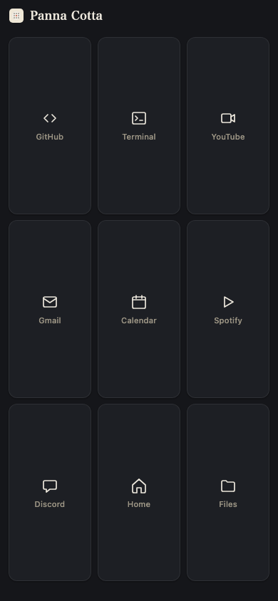
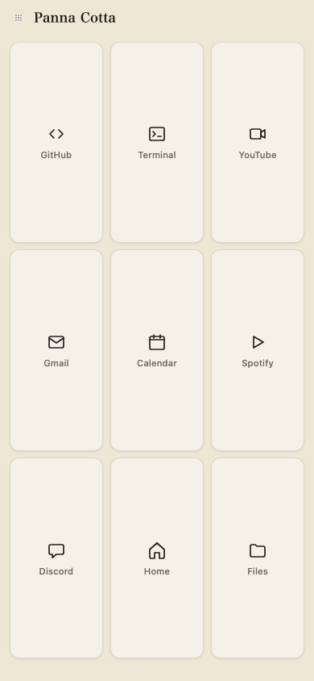
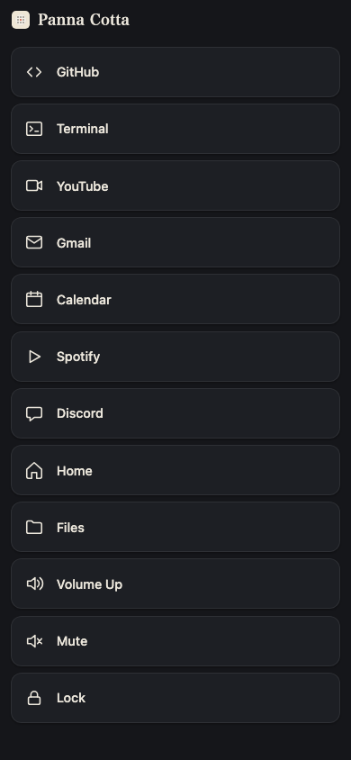

<!-- prettier-ignore -->
<div align="center">
  
  <h1>Panna Cotta</h1>
  <p>A native macOS app that turns any phone or tablet into a wireless control panel for your Mac.</p>

[](https://github.com/mike623/panna-cotta/actions)
[](LICENSE)

[Features](#features) • [Quick start](#quick-start) •
[Development](#development) • [Building](#building)

</div>

---

Open the app on your Mac. Scan the QR code on your phone. Tap a button to launch
an app, open a URL, control media, lock the screen — instantly, from across the
room.

<div align="center">
  
  &nbsp;
  
  &nbsp;
  
</div>

## Features

- **Admin UI** — configure buttons, profiles, and themes from a native macOS
  window; no file editing required
- **Configurable grid** — set rows and columns to match your device's layout
- **Multiple profiles** — switch between different button sets in one click
- **Multiple action types** — open a URL, launch a macOS app, control system
  functions (volume, lock, sleep, media playback)
- **Any inline icon** — choose from a built-in icon set drawn with SVG paths
- **Pagination** — extra buttons overflow into additional pages automatically
- **Swipe to paginate** — drag left/right to switch pages; snaps back if not
  committed
- **List view** — toggle between grid and scrollable list with one tap;
  preference persists
- **Touch Bar autocomplete** — a suggestion strip appears when your Mac's
  keyboard monitor detects a partial word; tap to type or long-press to copy
- **PWA installable** — add to your phone or tablet home screen for a native
  feel
- **Offline-capable** — service worker caches the UI so it loads without a
  network hop
- **Dark / light theme** — toggle manually; preference is remembered
- **QR code quick-connect** — scan the home page to connect a new device in
  seconds
- **Auto-update** — notified of new releases automatically; updates install on
  next launch

## Quick start

**Requires macOS.**

Download the latest `.dmg` from the
[Releases page](https://github.com/mike623/panna-cotta/releases), open it,
drag Panna Cotta to Applications, and launch it.

A tray icon appears. Click **Open** to see the QR code, or **Admin Config** to
edit your buttons. Scan the QR code on any phone or tablet to open the LAN
panel.

> [!TIP]
> Your panel URL is also shown in the tray menu — share it or type it manually
> if QR scanning isn't convenient.

## Development

### Prerequisites

- [Rust toolchain](https://rustup.rs) (stable)
- [Node.js](https://nodejs.org) 18+
- [Tauri CLI prerequisites for macOS](https://v2.tauri.app/start/prerequisites/#macos)

### Commands

```sh
# Dev (Vite + Tauri hot-reload)
cd packages/desktop
npm install
npm run tauri dev

# Rust unit tests
cd packages/desktop/src-tauri
cargo test

# Rust lint
cargo clippy

# Frontend build only
cd packages/desktop
npm run build
```

### Project structure

```
packages/
  frontend/
    app.js              # LAN panel UI (served to phones/tablets)
    style.css           # CSS variables for dark/light theme
    sw.js               # Service worker
    manifest.json       # PWA manifest
  desktop/
    src/                # React admin SPA
      PannaApp.tsx      # Root component
      core.tsx          # DeviceCanvas, Glass, ProfilesRail
      ui.tsx            # ActionPalette, Inspector, Toolbar, etc.
      AutocompleteSettings.tsx
    src-tauri/
      src/
        app.rs          # Tauri builder: tray, windows, command registration
        server/
          mod.rs        # Axum HTTP server startup + port resolution
          routes.rs     # HTTP handlers (mirrors Tauri commands for LAN)
          state.rs      # AppState, profile CRUD, config read/write
        commands/       # Tauri IPC commands
      tauri.conf.json
      Cargo.toml
```

### Architecture

Panna Cotta is a Tauri app with an embedded Axum HTTP server.

- **Admin UI** — React SPA loaded in the native Tauri webview
  (`tauri://localhost/index.html`).
- **LAN panel** — plain HTML/JS (`packages/frontend/`) embedded in the
  binary and served over HTTP at `http://192.168.x.x:PORT/apps/`. Phones
  connect here.
- **Shared state** — `Arc<AppState>` shared between Axum handlers and Tauri
  commands. Config is always read from disk on demand.
- **Port persistence** — Axum picks a free port in 30000–39999 and writes it
  to `~/.panna-cotta.port`.
- **Profiles** — per-profile TOML files in `~/.panna-cotta/profiles/*.toml`.

### Screenshots

To regenerate the screenshots in `docs/screenshots/`:

```sh
cd packages/desktop
npm run screenshots
```

Requires Playwright's Chromium browser (`npx playwright install chromium` once).

## Building

```sh
cd packages/desktop
npm run tauri build
```

Produces a signed `.dmg` (macOS). The embedded LAN frontend is compiled into
the binary at build time via `include_dir!`.

### Releases

Tagged commits (`v*`) trigger GitHub Actions to build and publish a GitHub
Release with macOS `.dmg` binaries for Apple Silicon and Intel.
